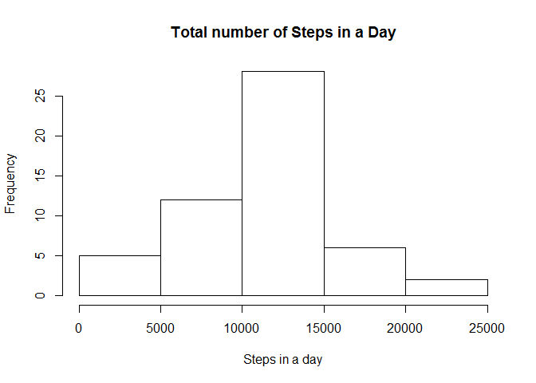
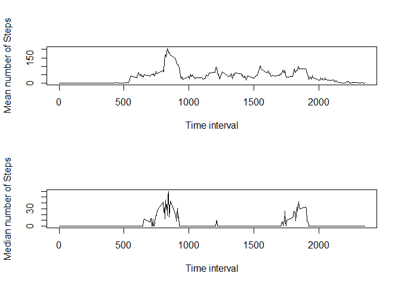
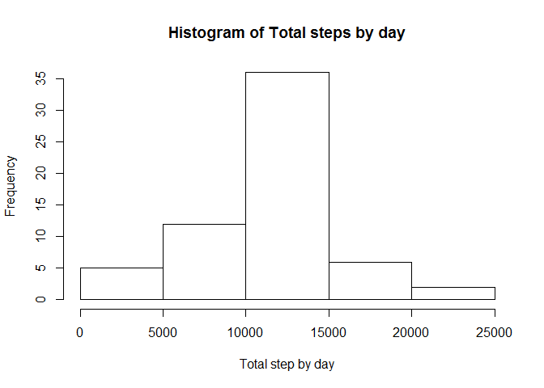
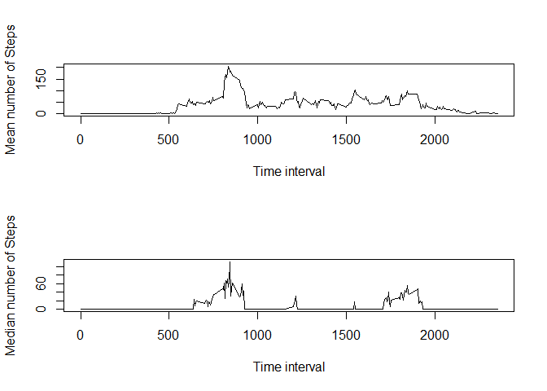
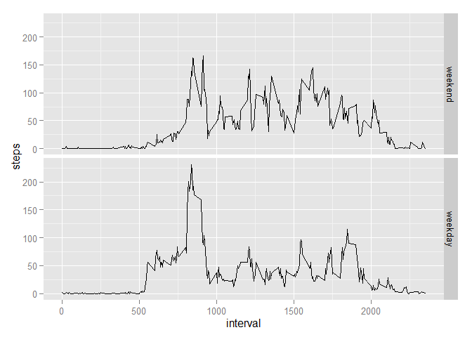

# Reproducible Research: Peer Assessment 1


## Loading and preprocessing the data

```r
#setwd("~/R/reproResearch/RepData_PeerAssessment1")
library(ggplot2)
library(dplyr)
```

```
## 
## Attaching package: 'dplyr'
## 
## The following object is masked from 'package:stats':
## 
##     filter
## 
## The following objects are masked from 'package:base':
## 
##     intersect, setdiff, setequal, union
```

```r
unzip('activity.zip')
activity <- read.csv("activity.csv")
str(activity)
```

```
## 'data.frame':	17568 obs. of  3 variables:
##  $ steps   : int  NA NA NA NA NA NA NA NA NA NA ...
##  $ date    : Factor w/ 61 levels "2012-10-01","2012-10-02",..: 1 1 1 1 1 1 1 1 1 1 ...
##  $ interval: int  0 5 10 15 20 25 30 35 40 45 ...
```
Coerce the 'date' column from character to Date type

```r
activity[,2] <- as.Date(activity$date)
```

## What is mean total number of steps taken per day?

```r
byDay <- summarize(group_by(activity, date), totalSteps=sum(steps))
par(mfrow = c(1,1))
hist(byDay$totalSteps, main = "Total number of Steps in a Day", xlab = "Steps in a day")
```

 
We find the mean/median by day and create a table with the results, we see lots of NA or 0's.


```r
meanByDay <- summarize(group_by(activity, date), meanSteps = mean(steps)) 
 
meanByDay$meanSteps
```

```
##  [1]         NA  0.4375000 39.4166667 42.0694444 46.1597222 53.5416667
##  [7] 38.2465278         NA 44.4826389 34.3750000 35.7777778 60.3541667
## [13] 43.1458333 52.4236111 35.2048611 52.3750000 46.7083333 34.9166667
## [19] 41.0729167 36.0937500 30.6284722 46.7361111 30.9652778 29.0104167
## [25]  8.6527778 23.5347222 35.1354167 39.7847222 17.4236111 34.0937500
## [31] 53.5208333         NA 36.8055556 36.7048611         NA 36.2465278
## [37] 28.9375000 44.7326389 11.1770833         NA         NA 43.7777778
## [43] 37.3784722 25.4722222         NA  0.1423611 18.8923611 49.7881944
## [49] 52.4652778 30.6979167 15.5277778 44.3993056 70.9270833 73.5902778
## [55] 50.2708333 41.0902778 38.7569444 47.3819444 35.3576389 24.4687500
## [61]         NA
```


```r
medianByDay <- summarize(group_by(activity, date), medianSteps = median(steps))
medianByDay$medianSteps
```

```
##  [1] NA  0  0  0  0  0  0 NA  0  0  0  0  0  0  0  0  0  0  0  0  0  0  0
## [24]  0  0  0  0  0  0  0  0 NA  0  0 NA  0  0  0  0 NA NA  0  0  0 NA  0
## [47]  0  0  0  0  0  0  0  0  0  0  0  0  0  0 NA
```

## What is the average daily activity pattern?
Create plots showing the average/median number of steps by time interval

```r
byInterval <-summarize(group_by(activity, interval ), averageSteps = mean(steps, na.rm = T), median = median(steps, na.rm = T))

par(mfrow = c(2,1))
plot(byInterval$interval, byInterval$averageSteps, type = 'l', ylab = "Mean number of Steps", xlab = "Time interval")
plot(byInterval$interval, byInterval$median, type = 'l', ylab = "Median number of Steps", xlab = "Time interval")
```

 

Let's find the interval with the max number of average steps

```r
byInterval[byInterval$averageSteps == max(byInterval$averageSteps),]
```

```
## Source: local data frame [1 x 3]
## 
##   interval averageSteps median
## 1      835     206.1698     19
```


## Imputing missing values
I think replacing by average value by interval will give us a fair guestimate.  Average by day is unsatisfactory since some days are composed entirely of missing values, such as the first day.  Replacingby median by interval results in many 0 values, which 
isn't as interesting?


```r
newActivity <- activity
for (int in newActivity$interval){
    tempMean <- mean(newActivity$steps[newActivity$interval == int], na.rm=T)
    newActivity[newActivity$interval == int & is.na(newActivity)] <- tempMean
}
summary(newActivity)
```

```
##      steps             date               interval     
##  Min.   :  0.00   Min.   :2012-10-01   Min.   :   0.0  
##  1st Qu.:  0.00   1st Qu.:2012-10-16   1st Qu.: 588.8  
##  Median :  0.00   Median :2012-10-31   Median :1177.5  
##  Mean   : 37.38   Mean   :2012-10-31   Mean   :1177.5  
##  3rd Qu.: 27.00   3rd Qu.:2012-11-15   3rd Qu.:1766.2  
##  Max.   :806.00   Max.   :2012-11-30   Max.   :2355.0
```

Creating a histogram of the total number of steps by day of our NA free newActivity data

```r
newbyDay <- summarize(group_by(newActivity, date), totalSteps=sum(steps))

hist(newbyDay$totalSteps,main = 'Histogram of Total steps by day', xlab = "Total step by day")
```

 

```r
newActivity[3,]
```

```
##       steps       date interval
## 3 0.1320755 2012-10-01       10
```


Create plots showing the average/median number of steps by time interval

```r
newbyInterval <-summarize(group_by(newActivity, interval ), averageSteps = mean(steps, na.rm = T), median = median(steps, na.rm = T))

par(mfrow = c(2,1))
plot(newbyInterval$interval, newbyInterval$averageSteps, type = 'l', ylab = "Mean number of Steps", xlab = "Time interval")
plot(newbyInterval$interval, newbyInterval$median, type = 'l', ylab = "Median number of Steps", xlab = "Time interval")
```

 


A list of the mean number of steps by day

```r
newMeanByDay <- summarize(group_by(newActivity, date), meanSteps = mean(steps)) 
newMeanByDay$meanSteps
```

```
##  [1] 37.3825996  0.4375000 39.4166667 42.0694444 46.1597222 53.5416667
##  [7] 38.2465278 37.3825996 44.4826389 34.3750000 35.7777778 60.3541667
## [13] 43.1458333 52.4236111 35.2048611 52.3750000 46.7083333 34.9166667
## [19] 41.0729167 36.0937500 30.6284722 46.7361111 30.9652778 29.0104167
## [25]  8.6527778 23.5347222 35.1354167 39.7847222 17.4236111 34.0937500
## [31] 53.5208333 37.3825996 36.8055556 36.7048611 37.3825996 36.2465278
## [37] 28.9375000 44.7326389 11.1770833 37.3825996 37.3825996 43.7777778
## [43] 37.3784722 25.4722222 37.3825996  0.1423611 18.8923611 49.7881944
## [49] 52.4652778 30.6979167 15.5277778 44.3993056 70.9270833 73.5902778
## [55] 50.2708333 41.0902778 38.7569444 47.3819444 35.3576389 24.4687500
## [61] 37.3825996
```

a list of the median number of steps by day

```r
newMedianByDay <- summarize(group_by(newActivity, date), medianSteps = median(steps))
newMedianByDay$medianSteps
```

```
##  [1] 34.11321  0.00000  0.00000  0.00000  0.00000  0.00000  0.00000
##  [8] 34.11321  0.00000  0.00000  0.00000  0.00000  0.00000  0.00000
## [15]  0.00000  0.00000  0.00000  0.00000  0.00000  0.00000  0.00000
## [22]  0.00000  0.00000  0.00000  0.00000  0.00000  0.00000  0.00000
## [29]  0.00000  0.00000  0.00000 34.11321  0.00000  0.00000 34.11321
## [36]  0.00000  0.00000  0.00000  0.00000 34.11321 34.11321  0.00000
## [43]  0.00000  0.00000 34.11321  0.00000  0.00000  0.00000  0.00000
## [50]  0.00000  0.00000  0.00000  0.00000  0.00000  0.00000  0.00000
## [57]  0.00000  0.00000  0.00000  0.00000 34.11321
```


Overall we see that imputing the inverval mean for the missing data has increased the average number of steps


## Are there differences in activity patterns between weekdays and weekends?
Create a new "day" column containing factor variables inticating whether the day was a weekday or weekend.


```r
newActivity <- mutate(newActivity, day = weekdays(date))
newActivity[newActivity$day == "Saturday"| newActivity$day == 'Sunday',4] <- 'weekend'
newActivity[newActivity$day != 'weekend', 4] <- "weekday"
newActivity$day <- factor(newActivity$day, levels = c("weekend", "weekday"))
```

Plot the average number of steps by interval for both weekdays and weekends.


```r
bydayInterval <- summarize(group_by(newActivity,day, interval), steps = mean(steps))
qplot(interval, steps, data =bydayInterval, facets =day~., geom = 'line' )
```

 
